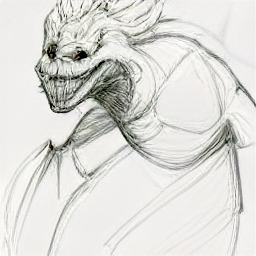

⚠ Everything is unstable for now ⚠
# NULL-A



This Image is the result of 'NULL-A Sketch' generated by [min-dalle](https://huggingface.co/spaces/kuprel/min-dalle)

Machine Model's Inference GUI

## Install 
 ```
 conda create -n nulla python=3.8
 pip install -r requirments.txt
 ```

## Run
 `python main.py`
```
usage: nulla [-h] [--source SOURCE] [--model MODEL]

optional arguments:
  -h, --help       show this help message and exit
  --source SOURCE 動画リソースを設定(数字:WEBカメラ,URL:IPカメラ,ファイルパス:ローカル動画)
  --model MODEL Detector名
```


## Build
### Build pyd

Build cython module

`python setup.py build_ext --inplace`

### Build App
 `pyinstaller main.spec`


## Reference

* Cython https://github.com/cython/cython
* Onnx Model Zoo https://github.com/onnx/models

## TODO
* モデル切り替え時に時々推論がストップする.
* 動画の切り替え
* OnnxRuntime-GPU